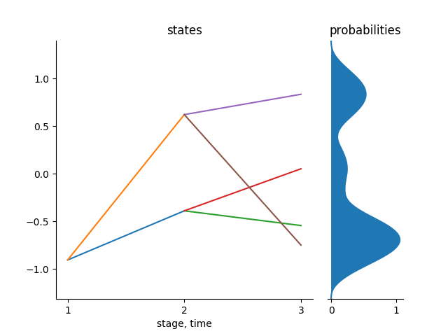
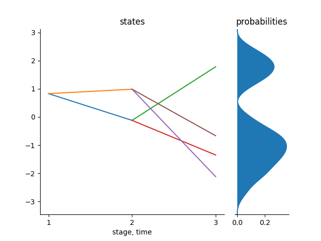

```@meta
CurrentModule = StochasticDominance
```

# Scenario Trees

Consider a general stochastic process ``X`` over a discrete time space ``T``, i.e., ``X = (X_1,\dots,X_T)`` where ``X_1`` is a deterministic starting value and the rest are random values or random vectors whose probability distribution is known. A scenario tree is a discrete time and discrete state process approximating the process `X`. We represent the scenario tree by ``\tilde{X} = (\tilde{X}_1,...,\tilde{X}_T)``. A scenario is a path from the root node to any of the leaves in the tree. The number of stages in a scenario must be equal to the number of stages in a scenario tree which is equal to the length of the sample from the stochastic process ``X``.

A basic scenario tree can be created using the `Tree(bstructure::Array{Int64,1}, dimension::Int64)` function in the package. This function takes the branching structure of the tree and the dimension of the states that you are working on. For example, consider a tree with a branching structure of `1x2x2`. This is a tree with a root in stage `1`, and `2` nodes in stage 2 and each of the `2` nodes in stage two has `2` nodes in stage `3` and each node has only one state and so `dimension = 1`.

```julia
julia> example1 = Tree([1,2,2],1);
julia> treeplot(example1);
```

The above tree basically is not optimal since we just randomly fill the states of the nodes of a tree with random values. This is an example of a scenario tree to begin with in stochastic approximation process. We start with a tree like this and then we use samples from a known distribution to improve the tree for a certain specified number of iterations as we shall see in the tutorials to follow.



The above tree is in 1-state dimension.

The following shows the procedure to plot trees in 2 or higher dimension. We will employ the use of the function `part_tree()` which partitions the main tree into sub-trees of different states. For example, if the main tree is in 2 dimension, this function will return an array with two trees where the only difference is the states of the nodes of the trees. Then, we can plot each of this trees and display. Alternatively, you can use the function `plot_hd` which plots the trees in any dimension without partition.

```julia
julia> example2 = Tree([1,2,2], 2);
julia> example2Trees = part_tree(example2);
julia> tree_plot(example2Trees[1])
julia> savefig("example21.png")
julia> tree_plot(example2Trees[2])
julia> savefig("example21.png")
```

| [](../assets/example21.png)  | [](../assets/example22.png) |
|:---:|:---:|
| Tree of state 1 | Tree of state 2 |

And in general, we can generate a tree in any `d` state dimension.

## Functions describing a scenario tree

The above tree can described by the following functions: _nodes_, _stages_, _height_, _leaves_ and the _root_ of the tree.

Each tree has stages starting from ``1`` where the root node is.

### Nodes of the tree

This are the vertices that are in the scenario tree. Each node in the tree has a parent node except the root node where the tree starts from. As stated before, each scenario tree is characterized by its name, parents of the nodes , children of each parent nodes e.t.c. So therefore, we have nodes which has parents and those nodes are the children of the parent nodes.

For example,

```julia
julia> nodes(example1)
1:7
```

### Stages of the tree

Each node in a tree is in a specific stage and nodes in the same stage have the same number of children. The stages in a tree starts from `0` where the root node is and ends at stage `T` where the leaf nodes are.

```julia
julia> stage(example1)
0
1
1
2
2
2
2
```
