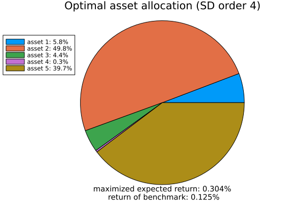
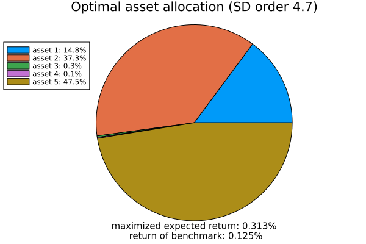

```@meta
CurrentModule = StochasticDominance
```

# Optimization: Maximizing Expected Returns

This tutorial demonstrates how to use the `optimize_max_return_SD` function to find the optimal portfolio allocation $x$. This function ensures that the weighted portfolio assets $x^{\top}\xi$ dominate the benchmark $\xi_0$ while maximizing $\mathbb{E}\, x^{\top} \xi$.

## Mathematical Framework

This problem arises in portfolio optimization. Define the simplex:

```math
\mathcal{S} \coloneqq \left\{(x_1, \dots, x_d) \mid x_i \geq 0 \text{ for } i=1, \dots, d, \text{ and } \sum_{i=1}^{d} x_i = 1 \right\}.
```

The non-linear optimization problem can be rewritten as:

```math
\begin{aligned}
   \max_{x \in\mathcal{S} }   & \quad \mathbb{E}\, x^{\top} \xi \\
    \text{subject to } & \quad \xi_0 \preccurlyeq^{(p)} x^{\top} \xi, \\
                        & \quad x \in \mathcal{S}.
\end{aligned}
```

Here, $\xi_0 \in \mathbb{R}^{n}$ represents the return of a benchmark portfolio, while $\xi \in \mathbb{R}^{d \times n}$ denotes the assets returns. The formulation considers $d$ assets and $n$ scenarios.

## Example 1 

In the first example, we illustrate the function `optimize_max_return_SD` using representative data.

```julia-repl
# Define portfolio return scenarios (rows: assets, columns: scenarios)
julia> ξ = [0.02  0.05 -0.01;  # Asset 1 returns under different scenarios
     0.03  0.06  0.02]   # Asset 2 returns under different scenarios

# Define benchmark return scenarios (column vector)
julia> ξ_0 = [0.01, 0.04, 0.00]  # Benchmark returns in the same scenarios

# Define probability distributions for portfolio and benchmark scenarios
julia> p_ξ = [0.3, 0.4, 0.3]     # Probabilities for each scenario
julia> p_ξ_0 = [0.4, 0.4, 0.2]   # Probabilities for benchmark scenarios

# Set the order of stochastic dominance
julia> SDorder = 2  # Second-order stochastic dominance

julia> x_opt, t_opt = optimize_max_return_SD(ξ, ξ_0,SDorder;p_ξ, p_ξ_0,ε=1e-6,verbose=true)
```
### Output

```julia-repl
Simplex Constraints residuals: 4.0992834682285206e-7
Stochastic Dominance Constraints residuals: 0.0
julia> println("Optimal asset allocation x: ",x_opt)
Optimal asset allocation x:[0.002684844820915079, 0.997314745250738]
julia> println("Optimal Objective: expected_portfolio_return(x_opt,ξ,p_ξ)", )
Optimal Objective: 0.03895702649565983
```
In general, the output provides the optimal asset allocation vector $x$ of length $ d $ and a single optimal $t$ that confirms the stochastic dominance of the given order. For more technical details on reducing the verification of infinitely many $t$ (i.e., $t \in \mathbb{R}$) to a single value, refer to [Lakshmanan et al. 2025](https://arxiv.org/abs/2501.14565). 

## Example 2 

For this example, we consider the standardized dataset from [Fama and French 2023](https://mba.tuck.dartmouth.edu/pages/faculty/ken.french/data_library.html). 

```julia
julia> using DataFrames
julia> using Dates
julia> data = DataFrame(
    Date = Date.([Date("2024-07-01"), Date("2024-07-02"), Date("2024-07-03"), Date("2024-07-05"), Date("2024-07-08"), Date("2024-07-09"), Date("2024-07-10"), Date("2024-07-11"), Date("2024-07-12"), Date("2024-07-15"), Date("2024-07-16"), Date("2024-07-17"), Date("2024-07-18"), Date("2024-07-19"), Date("2024-07-22"), Date("2024-07-23"), Date("2024-07-24"), Date("2024-07-25"), Date("2024-07-26"), Date("2024-07-29"), Date("2024-07-30"), Date("2024-07-31")]),
    Asset_1 = [-1.01, -2.50, -0.38, -1.11, 0.44, 0.05, -0.34, 4.00, 1.76, 1.53, 2.77, 0.71, -2.24, 0.08, 0.35, 2.55, -2.21, 1.67, 0.17, -0.97, -0.11, 0.24],
    Asset_2 = [-0.72, -0.22, 0.27, 0.15, -0.22, -1.49, 0.79, 1.60, 1.04, 0.02, 1.28, 0.69, -1.24, -1.51, 0.29, -0.09, 2.88, -0.21, 1.26, -0.79, 0.79, 1.89],
    Asset_3 = [1.10, -0.86, -0.21, -0.33, -0.64, 1.52, 1.31, 2.53, -0.06, -3.42, 2.59, -1.44, -1.74, -0.23, -0.54, 0.08, -1.61, 1.05, 2.29, -0.48, 0.98, 0.72],
    Asset_4 = [-1.80, -0.09, 0.41, 2.10, 0.59, -2.59, 2.75, 0.73, 0.41, -2.50, 0.40, 1.12, -1.72, -2.67, -0.42, -0.39, -2.51, 0.00, 0.93, -0.48, -1.65, -1.14],
    Asset_5 = [-0.65, 0.64, 0.41, -1.61, 0.33, -0.26, 1.93, 3.72, 2.17, -0.63, 1.83, 0.94, -1.78, -1.81, -0.25, 1.14, -0.41, 2.21, 2.13, -1.13, 0.07, -1.23]
)
julia> ξ =  Matrix(select(data, Not(:Date)))'  # Define Portfolio matrix ξ ∈ R^{d×n} d assets and n scenarios
julia> d, n = size(ξ) 
julia> τ = fill(1/d,d)  # equally weights
julia> ξ_0 = vec(τ'*ξ) # Define Benchmark  ξ_0 ∈ R^{n}
julia> p_ξ = fill(1/n,n)  # Probability vectors for x'*ξ ∈ R^{n} , where x is portfolio weights 
julia> p_ξ_0 = fill(1/n,n) # Probability vectors for ξ_0 ∈ R^{n}
```
### Output

```julia
julia> SDorder = 4.0 # Define SD order
julia> x_opt, t_opt = optimize_max_return_SD(ξ, ξ_0,SDorder;p_ξ,p_ξ_0,plot=true) # Run the optimization
```



### Non-integer SD orders

```julia
julia> SDorder = 4.7 
julia> x_opt, t_opt = optimize_max_return_SD(ξ, ξ_0,SDorder;p_ξ,p_ξ_0,plot=true) # Run the optimization
```


