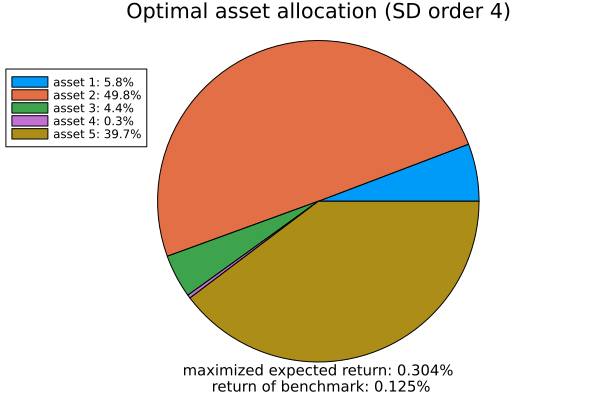

# Summary

Stochastic dominance plays a key role in decision-making under uncertainty and quantitative finance. It helps evaluate whether one investment, policy, or strategy is better than others in uncertain conditions. It provides a mathematically rigorous method often used in optimization to maximize returns or minimize risk. See [@Ogryczak:2002], [@Dentcheva:2003], [@Kuosmanen:2004], [@Kopa:2017], [@Kopa:2023], [@Maggioni:2016], [@Maggioni:2019], and [@Consigli:2023] for an extensive body of research on the applicability of stochastic dominance.

# Statement of need

Despite being a crucial tool, (higher-order) stochastic dominance involves infinitely many constraints, making it *computationally intractable* in practice. Our recent research [@Lakshmanan:2025] addresses this challenge by theoretically reducing the infinite constraints to a finite number. However, no concrete, user-friendly implementation of (higher-order) stochastic dominance has been developed. Additionally, the existing prominent theoretical algorithms only discuss stochastic orders *two* and *three*, but not higher orders. Moreover, both, the discussion and implementation of non-integer orders, are absent. 

To address this gap, we present *StochasticDominance.jl*, an open-source Julia package tailored for verification and optimization under higher-order stochastic dominance constraints.  


# Main features of the package

**Technical highlights.** The StochasticDominance.jl package offers robust functions for verifying higher-order stochastic dominance constraints between two random variables. It supports two primary objective functions by maximizing expected returns and minimizing higher-order risk measures to achieve the optimal asset allocation while satisfying higher-order stochastic dominance constraints. The package's optimization framework is built around Newton’s method, which efficiently handles the non-linear constraints. To enhance efficiency, we first employ Particle Swarm Optimization (PSO), which approximates the solution over a set number of iterations. In our previous work, [@Lakshmanan:2025] initially impose two fixed higher-order stochastic dominance constraints and dynamically introduce additional constraints to ensure dominance. To simplify the process and align with a black-box approach, this package uses these constraints with additional theoretical backing, eliminating the need for dynamic adjustments. Below, we provide a concise overview of its key functions.

1.  `verify_dominance`: This function checks whether the given benchmark asset, represented as the random variable $X$, and the weighted portfolio asset, represented as the random variable $Y$, exhibit a dominance relationship for the specified stochastic order.

2. `optimize_max_return_SD`: This function determines the optimal asset allocation that maximizes expected returns for a given stochastic order (`SDorder`).

3. `optimize_min_riskreturn_SD`: This function determines the optimal asset allocation by minimizing higher-order risk measures for a given stochastic order (`SDorder`) while also indicating whether dominance is achieved.
Further implementation details and various examples are available in the package’s [documentation](https://rajmadan96.github.io/StochasticDominance.jl/dev/).

# Example: verification and portfolio optimization

The first example demonstrates how to use the `verify_dominance` function to check stochastic dominance of a specified order.
```julia-repl
julia> using StochasticDominance            # Load the package
julia> Y = [3, 5, 7, 9, 11]                 # Random variable Y
julia> p_Y = [0.15, 0.25, 0.30, 0.20, 0.10] # Probabilities associated with Y
julia> X = [2, 4, 6, 8, 10]                 # Random variable X
julia> p_X = [0.10, 0.30, 0.30, 0.20, 0.10] # Probabilities associated with X
```
Next, define the stochastic order and execute the function as shown below
```julia
julia> SDorder = 2
julia> verify_dominance(Y, X, SDorder; p_Y, p_X)
Y dominates X in stochastic order 2
```
This function checks whether $Y$ stochastically dominates $X$ of order `SDorder`.

## Optimization: maximize expected return

Next, we demonstrate how to find the optimal allocation that maximizes the expected return of the portfolios of interest while satisfying stochastic dominance of a given order. See [tutorials](https://rajmadan96.github.io/StochasticDominance.jl/dev/tutorial/tutorial3/) for a comprehensive technical explanation.

The `data.csv` file is located in the `/test` folder of the code repository.
```julia
julia> using CSV, Dates, DataFrames
julia> data = CSV.read("data.csv", DataFrame)
julia> xi =  Matrix(select(data, Not(:Date)))'
julia> d, n = size(xi)                  # (d=5 assets and n=22 scenarios)
julia> tau = fill(1 / d, d)             # Equal weights
julia> xi_0 = vec(tau' * xi)            # Define Benchmark
```

Use the following function to compute the optimal allocation (objective: maximize expected return):
```julia
julia> SDorder = 4;
julia> x_opt, t_opt = optimize_max_return_SD(
           xi,
           xi_0,
           SDorder;
           p_ξ = fill(1 / n, n),    # Uniform probability
           p_ξ_0 = fill(1 / n, n),  # Uniform probability
           plot=true,
       )
```
From `x_opt`, we obtain the optimal asset allocation. Enabling `plot=true` generates graphical representations summarizing key insights concisely.



If no portfolio allocation satisfies the stochastic dominance constraint of the given order, the algorithm stops and provides the necessary information.

## Optimization: minimizing higher-order risk measures

Next, we demonstrate how to determine the optimal allocation that minimizes higher-order risk measures while ensuring stochastic dominance of a given order for the portfolios of interest. See [tutorials](https://rajmadan96.github.io/StochasticDominance.jl/dev/tutorial/tutorial4/) for a detailed technical explanation.

Use the following function to compute the optimal allocation (objective: minimizing higher-order risk measure):

```julia
julia> SDorder = 4.7;
julia> x_opt, q_opt, t_opt = optimize_min_riskreturn_SD(
           xi,
           xi_0,
           SDorder;
           p_ξ = fill(1 / n, n),    # Uniform probability
           p_ξ_0 = fill(1 / n, n),  # Uniform probability
           β = 0.5,                 # Risk parameter
           r = 2.0,                 # Order of the risk measure
           plot=true,
       )
```
From `q_opt`, we derive the value of optimal parameter that satisfies the risk measure for the given portfolio. It is important to note that the objective itself is an optimization problem. However, our algorithm is designed to compute both simultaneously in a single execution. Additionally, the algorithm supports non-integer stochastic dominance orders. This feature is not restricted to this single setup but is available across all functions.


# References
